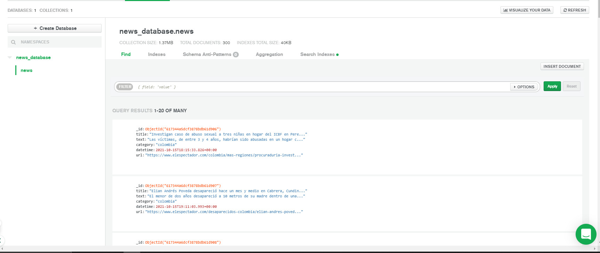
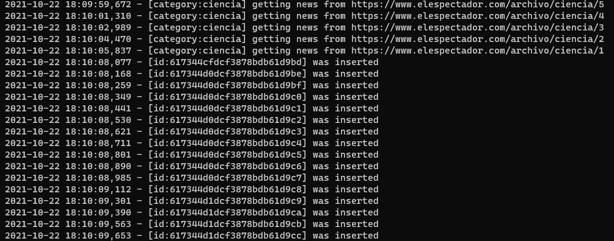

# Taller 2

| Estudiante    | Profesor    | Institución           | Materia                                    |
| ------------- | ----------- | --------------------- | ------------------------------------------ |
| Álvaro Stagg  | Fabian Peña | Universidad El Bosque | Electiva Profesional: Big Data & Analytics |

## Explicación

La explicación de este taller puede ser encontrada en [este vídeo de YouTube](https://youtube.com/).

### ¿Cómo Ejecutar Este Proyecto?

Lo primero que debe hacer es instalar las dependencias. Para esto, se recomienda
utilizar los ambientes virtuales de Python debido a que estos funcionan de manera
aislada y no "contaminan" su ambiente de desarrollo global. Para ello, recomiendo
utilizar [Pipenv](https://pipenv-es.readthedocs.io/es/latest/) pero debería funcionar
con cualquier gestor de ambientes virtuales. En caso de utilizar Pipenv, siga estos pasos
para instalar las dependencias:

Dentro del directorio del proyecto, previamente clonado con `git`, ejecute
los siguientes comandos en su terminal:

```sh
# descargar e instalar las dependencias
$ pipenv install
# ingresar al ambiente virtual
$ pipenv shell
# ejecutar el proyecto
$ python src/main.py
```

### Explicación y Evidencias de la Base de Datos

La base de datos MongoDB está organizada de la siguiente de la siguiente manera:
primero, se creó una base de datos llamada `news_database`, en esta base de datos
se creó una colección llamada `news` y dentro de esta colección están los docuemntos
que tienen la siguiente estructura:

```json
{
	"_id" : ObjectId("ID AUTO-GENERADO DE LA NOTICIA"),
	"title" : "TITULO DE LA NOTICIA",
	"category" : "CATEGORIA DE LA NOTICIA",
	"datetime" : ISODate("FECHA EN QUE FUE PUBLICADA LA NOTICIA"),
	"url" : "URL HACIA LA NOTICIA EN EL SITIO ORIGINAL"
}
```

El método que se encarga de insertar las noticias en la base de datos es
`insert_into_database`. En la siguiente imagen se observan algunos registros
insertados durante la ejecución del script.

### ¿Por Qué Esta es la Mejor Implementación?

Esta implementación del ejercicio propuesto en la clase es la más rápida y
ligera debido a que utiliza únicamente dependencias que pueden correr sin
necesidad de un entorno gráfico y además no depende de ningún navegador para
lograr la obtención de información por parte de la página de El Espectador.

Teniendo todo lo anterior en cuenta:

- No hay necesidad de ejecutar código JavaScript. ✅
- No hay necesidad de ejecutar estilos CSS. ✅
- No hay necesidad de ejecutar un navegador. ✅
- Puede correr en cualquier sistema operativo que soporte Python 3. ✅

Esto se logra gracias a un análisis realizado en el que se encontró que el
contenido de las noticias estaba presente en el código fuente de la página
en vez de ser auto-generado por una librería JavaScript. Utilizando una
expresión regular fue posible extraer este JSON que contenía toda la
información de las noticias y, luego de `parsear` este JSON, fue posible
extraer la información de las noticias sin necesidad de entrar a estas.

### Evidencias de Inserción

Visualización de registros desde el gestor de base de datos:



Visualización del script insertando datos:



### Evidencia de Análisis

Nube de palabras:


